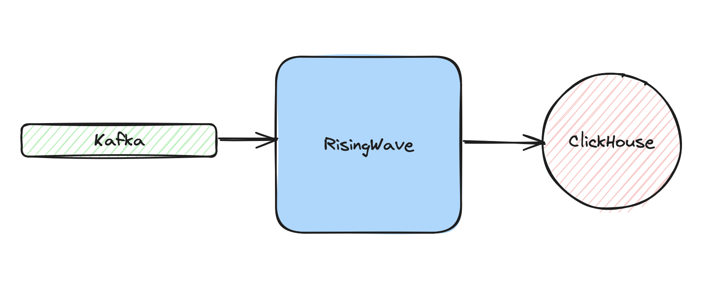

# Stream Processing in SQL with RisingWave



Before beginning on this section, make sure you have setup your environment according to the [README](./README.md).

## Setting up RisingWave with Docker Compose

Reference: https://docs.risingwave.com/docs/current/risingwave-docker-compose/

For this workshop, I have slightly modified the `docker-compose.yml` file to include clickhouse as well.

The `docker-compose.yml` file is located in the `docker` directory.

It contains the following key components:
- RisingWave (Stream Processing)
- Clickhouse (Downstream Delivery)
- Redpanda (Upstream Ingestion)
- Grafana (Visualization)
- Prometheus (Metrics)
- MinIO (Storage)
- Etcd (Metadata Storage)

## Ingesting Data into RisingWave using Kafka

Reference: https://docs.risingwave.com/docs/current/ingest-from-kafka/

The `seed_kafka.py` file contains the logic to process the data and populate RisingWave.

Here we:
1. Process the `taxi_zone` data and insert it into RisingWave. This is just ingested with DML over `psycog`, since it's a small dataset.
2. Process the `trip_data` and insert it into RisingWave. This is ingested via Kafka.

You may look at their definitions by running:
```bash
psql -c 'SHOW TABLES;'
```

## Stream Processing with Materialized Views in RisingWave

TODO: Explain each MV

## Simple Batch Query Serving with RisingWave

TODO: Explain each Batch

## How to sink data from RisingWave to Clickhouse

TODO: Explain each sink

## What's next?

https://tutorials.risingwave.com/docs/category/basics

## Homework

To further understand the concepts, please try the [Homework](./homework.md).